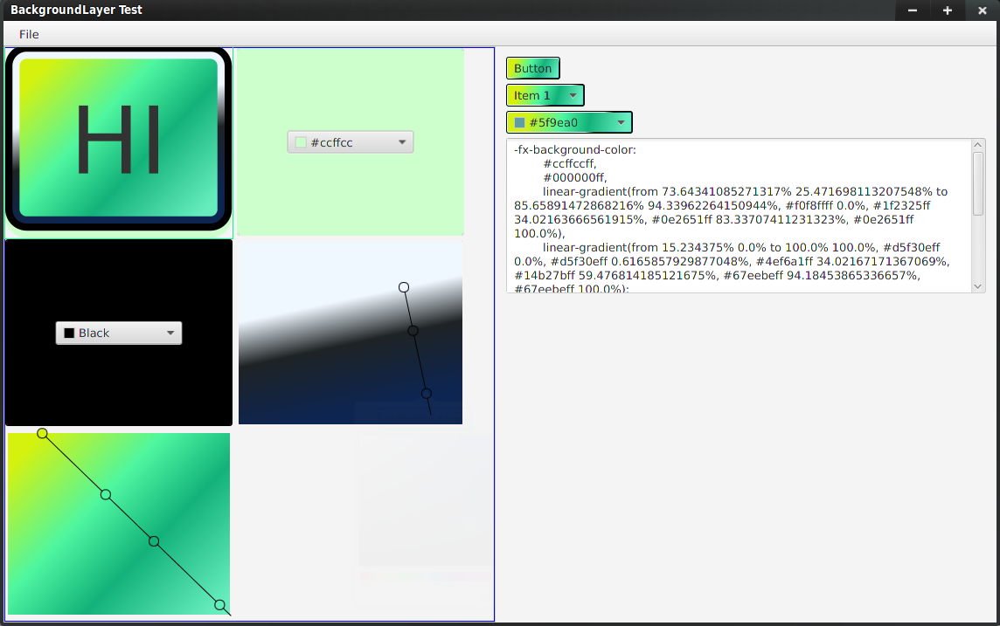
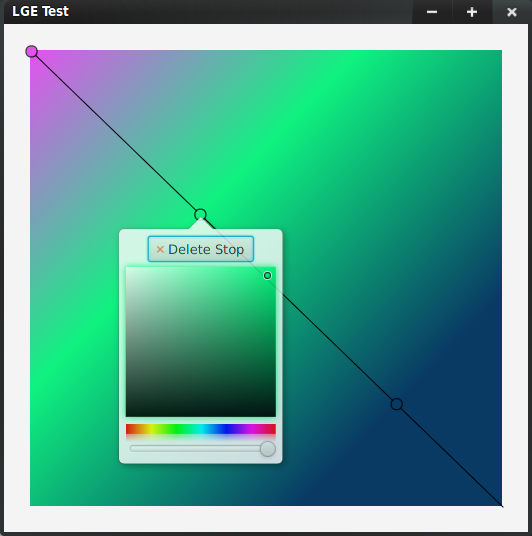
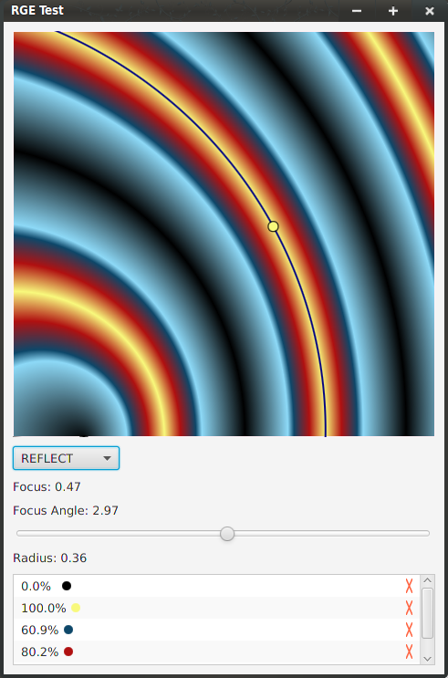

# CSSEditors

## About

CSSEditors is a WhatYouSeeIsWhatYouGet Tool for editing CSS attributes such as color, padding, corners etc. Above image depicts a Button and similar controls themed.
CSS is typically hand written by theme designers. This process is tedious because
designers have to try out various combinations before they arrive at the perfect design.
The text based nature of CSS files means designers have to type their designs, save them and refresh the page to see its effect. Even in Web IDEs that are built into the browsers only the last two steps are eliminated. Designs still have to be hand typed and for gradients like the above thats pretty long. CSSEditors is a collection of tools to modify CSS using GUI. The tool automatically generates the text CSS.

## Target

Right now I'm only targeting JavaFX 8 and more specifically the version of CSS that is supported by JavaFX. But later on it will be easy to adapt it for HTML5.

## Tools

CSS Editors contains tools or editors for editing specific CSS attributes.
So far most of the work has gone in making `LinearGradient` and `RadialGradient` editors.

### Linear Gradient Editor

The circles represent `Stop`s in a Gradient. You can  

- click anywhere to **add** a new `Stop` 
- drag them to **vary** `offset` 
- click on a circle to **delete** or change `Color` 
- right click and drag the end points to set `startX`, `startY`, `endX` and `endY`

### Radial Gradient Editor

The radial gradient editor is extremely feature rich and thoughtfully designed.
Often the controls such as `Stop` knobs get out of visual scope and become inaccessible. However the screenshot above portrays such a situation but shows the control knob right where you need it.  
This editor allows you to:

- add new `Stop`s
- delete existing `Stop`s
- change `offset` and `color` for each `Stop`
- adjust `center`, `radius`, `focus` and `focusAngle`

The GUI Controls are not a part of the editor. The editor is just the colorful rectangle applied to a `Pane` with a background. 
The pane's background is computed from the Editor's gradient color.

### Extra Notes

Much of the code base is filled with individual component tests and old code.
I still haven't decided upon a license yet, but it will be open source, either GPL or Apache.